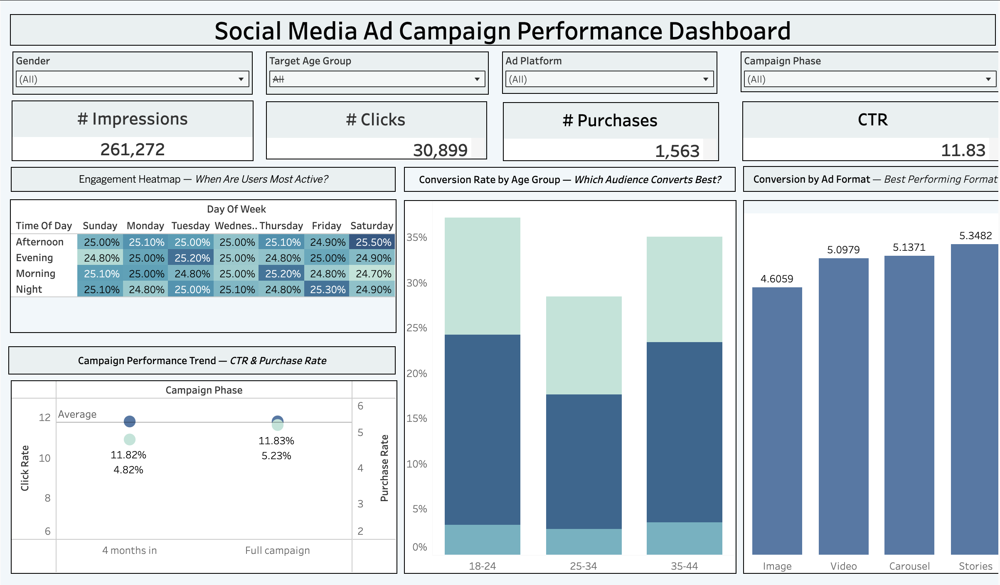
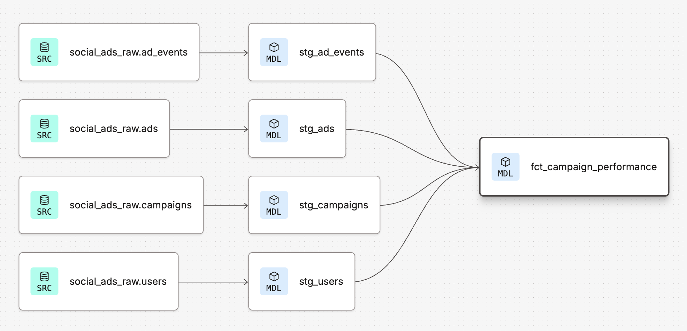

# Social Media Ad Campaign Performance Dashboard

An end-to-end data analytics project analyzing 400K+ social media ad events 
across platforms, audience segments, and campaign phases.

## Why We Built This
Social media advertising generates massive amounts of event data, but without 
proper analysis, marketers can't answer basic questions like:
- Which ad format actually drives purchases — not just clicks?
- Does targeting the 18-24 age group outperform 35-44?
- Did our campaign get more efficient over time?
- Is Facebook worth the higher spend compared to Instagram?

This dashboard was built to answer those questions using a full modern data 
stack — raw data in BigQuery, transformed via dbt, visualized in Tableau.

## Live Dashboard
[View on Tableau Public](https://public.tableau.com/app/profile/harikhumar.prabhakaran/viz/SocialMediaAdCampaignPerformanceDashboard/Dashboard1)

## Key Insights
- **Stories ads convert best** (5.34%) vs Image ads which perform worst (4.67%) 
  — suggesting dynamic formats outperform static ones
- **35-44 age group** shows the highest conversion rate across all genders, 
  making them the most valuable audience segment despite smaller volume
- **Purchase Rate improved from 4.93% to 5.23%** between mid-campaign and full 
  campaign phase — indicating targeting became more efficient over time
- **CTR remained stable at ~11.8%** across both phases — clicks stayed 
  consistent but quality of clicks improved as purchase rate grew
- **Engagement is evenly distributed** across days and times — no single 
  peak window, suggesting the algorithm distributes ads effectively

## Tech Stack
- **BigQuery** — cloud data warehouse (project: `social-ads-analytics`)
- **dbt Cloud** — data modeling and transformation
- **Google Colab** — data ingestion and BigQuery loading
- **Tableau Public** — interactive dashboard

## Dataset
Social Media Advertisement Performance — Kaggle
403,967 rows across 4 tables: users, campaigns, ads, ad_events

## dbt Lineage

## dbt Models
**Staging**
- `stg_users` — cleaned user demographics
- `stg_campaigns` — campaign metadata
- `stg_ads` — ad format and budget
- `stg_ad_events` — impression, click, purchase events

**Marts**
- `fct_campaign_performance` — joined fact table with campaign phase 
  classification

## Dashboard Features
- KPIs: Impressions, Clicks, Purchases, CTR
- Engagement Heatmap by Day & Time
- CTR vs Purchase Rate by Campaign Phase
- Conversion Rate by Ad Format
- Conversion Rate by Age Group
- Filters: Gender, Age Group, Ad Platform, Campaign Phase
